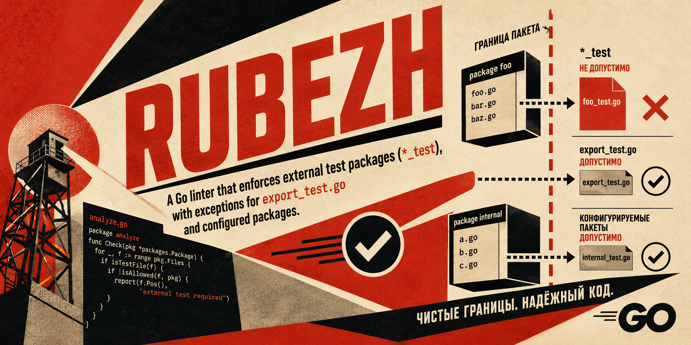

<p align="center">
  
</p>

# Rubezh

<p align="center">
  <i>рубеж — Enforces external test packages in Go</i>
</p>

Rubezh is a Go linter that requires test files to use an external test package whose name ends in `_test` (for example, `package foo_test`).

This keeps tests
focused on the package's public API instead of its unexported implementation.

Rubezh accepts both Go source files and Go package patterns:

```sh
rubezh foo_test.go bar_test.go
rubezh ./...
```

When no arguments are provided, Rubezh checks `./...`.
The conventional `export_test.go` file may use the package under test without
the `_test` suffix.

[](/LICENSE)
[](https://github.com/aethiopicuschan/rubezh/actions/workflows/release.yaml)
[](https://pkg.go.dev/github.com/aethiopicuschan/rubezh)
[](https://goreportcard.com/report/github.com/aethiopicuschan/rubezh)
[](https://github.com/aethiopicuschan/rubezh/actions/workflows/ci.yaml)
[](https://codecov.io/gh/aethiopicuschan/rubezh)

## How to install

You can download the latest release from the [release page](https://github.com/aethiopicuschan/rubezh/releases).

If you have Go installed, you can also install Rubezh using the following command:

```sh
go install github.com/aethiopicuschan/rubezh@latest
```

If you want to build Rubezh from source, you can clone the repository and run the following commands:

```sh
git clone https://github.com/aethiopicuschan/rubezh.git
cd rubezh
go build -o rubezh
```

## GitHub Actions

Add Rubezh to your workflow after checking out the repository:

```yaml
name: Rubezh

on:
  pull_request:
  push:

jobs:
  lint:
    runs-on: ubuntu-latest
    steps:
      - uses: actions/checkout@v4
      - uses: aethiopicuschan/rubezh@v1
```
